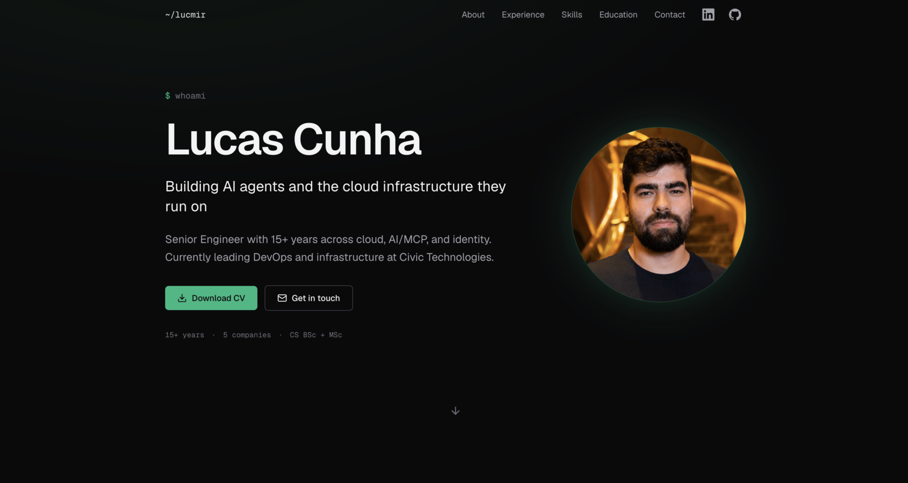

# lucmir.dev

Personal site of **Lucas Cunha** — engineer building AI agents and the cloud infrastructure they run on.



## Stack

- [Next.js 16](https://nextjs.org) (App Router) + [React 19](https://react.dev) + [TypeScript](https://www.typescriptlang.org/)
- [Tailwind CSS v4](https://tailwindcss.com/) with CSS variables for theming
- [Geist Sans / Geist Mono](https://vercel.com/font) via `next/font`
- [lucide-react](https://lucide.dev) for icons
- [Vercel Analytics](https://vercel.com/docs/analytics)
- Hosted on [Vercel](https://vercel.com)

## Develop

```bash
pnpm install
pnpm dev
```

Open [http://localhost:3000](http://localhost:3000).

## Build

```bash
pnpm build       # production build (Turbopack)
pnpm start       # serve the build locally
pnpm lint        # eslint
```

## Environment variables

| Variable                | Required | Purpose                                     |
| ----------------------- | -------- | ------------------------------------------- |
| `NEXT_PUBLIC_SITE_URL`  | No       | Canonical site URL used in metadata, sitemap, and OG tags. Defaults to `https://lucmir.dev`. |

## Project layout

```
app/
  layout.tsx              # root layout, metadata, JSON-LD Person schema, Analytics
  page.tsx                # composes all sections
  opengraph-image.tsx     # dynamically generated 1200x630 social card
  sitemap.ts, robots.ts   # SEO metadata routes
  not-found.tsx           # custom 404
  icon.png, apple-icon.png
components/
  nav.tsx                 # sticky nav with mobile hamburger + section-active highlight
  hero-photo.tsx          # hover/tap photo swap (smile ↔ serious)
  reveal.tsx              # IntersectionObserver fade-up wrapper (respects prefers-reduced-motion)
  brand-icons.tsx         # inlined GitHub / LinkedIn SVGs (lucide v1 dropped brand icons)
  section-heading.tsx
  sections/               # hero, about, experience, skills, education, contact
lib/
  cv-data.ts              # typed source of truth for all content
public/
  cert-*.jpg              # Anthropic certificate scans
  logo-*.png|svg          # company logos in the experience timeline
  eu-profile.png          # smiling portrait (hover state)
  eu-serious.png          # default portrait
  LucasCunha_cv.pdf       # downloadable CV
docs/
  screenshot.png
```

## Deploy

Auto-deploys to Vercel on every push to `main`. Preview URLs for PRs.

To deploy manually:

```bash
pnpm dlx vercel --prod
```

## License

MIT.
